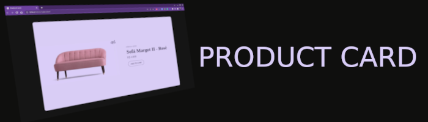

<h1>🛍️ Product Card<h1> 
<h4><strong>🗒️ Description</strong></h4>

Layout for an online store product card, using HMTL5, CSS3, and Javascript. This project was inspired by Rocketseat challenge #BoraCodar. The design was kept with some modifications in the Javascript implementation.

 <h4><strong>💻 Technologies used</strong></h4>

	<code></code>
	<code></code>
	<code></code>

